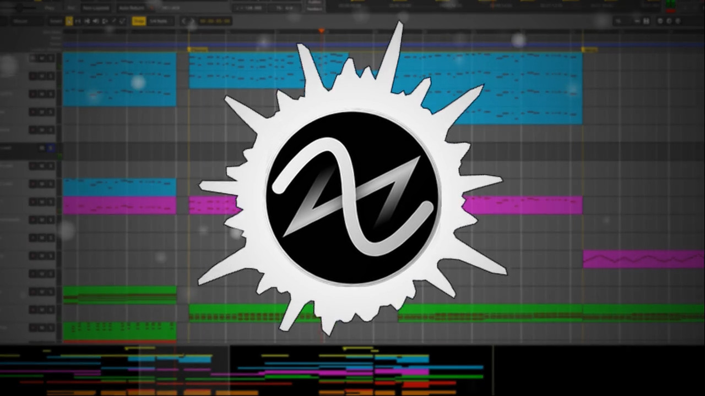

# Modular Music Visualizer

An attempt to make a music visualization software

(Link to unlisted video of the full music in the image above)[https://youtu.be/BhpLwaR1Oj8]

# Running

Only works on Linux at the time (haven't tested on Windows)

`git clone https://github.com/Tremeschin/modular-music-visualizer`

`cd modular-music-visualizer/src`

[Use a Python venv](https://github.com/Tremeschin/dandere2x-tremx/wiki/Python-venvs) (recommended):

- `python -m venv mmv-venv`

- `source ./mmv-venv/bin/activate`

`pip install -r requirements.txt`

`python main.py -h` to see help

Configure the stuff under `mmvanimation.py` on function `generate` and follow the code flow

I 95% the time run with `python main.py -w 8 -m -i banjo.ogg`

`-m` is multiprocessed, `-w 8` 8 workers as that saturates my CPU and the input is the included `banjo.ogg` on the src dir
